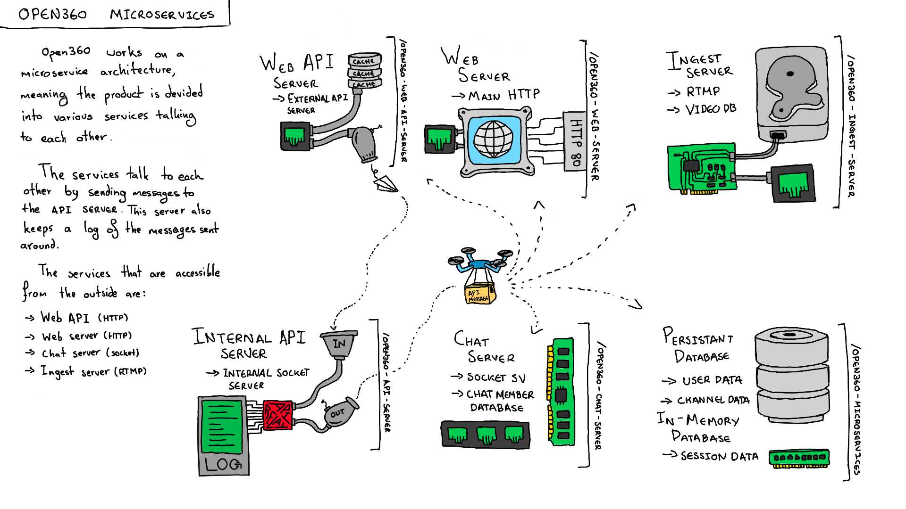
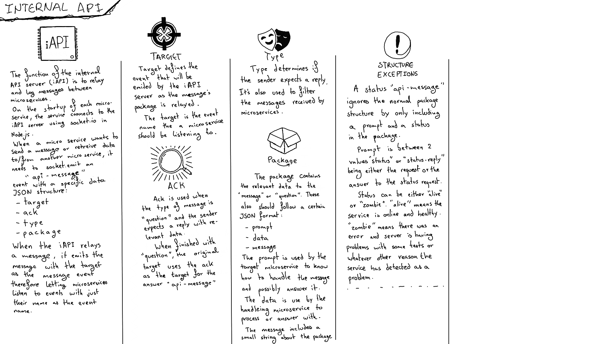
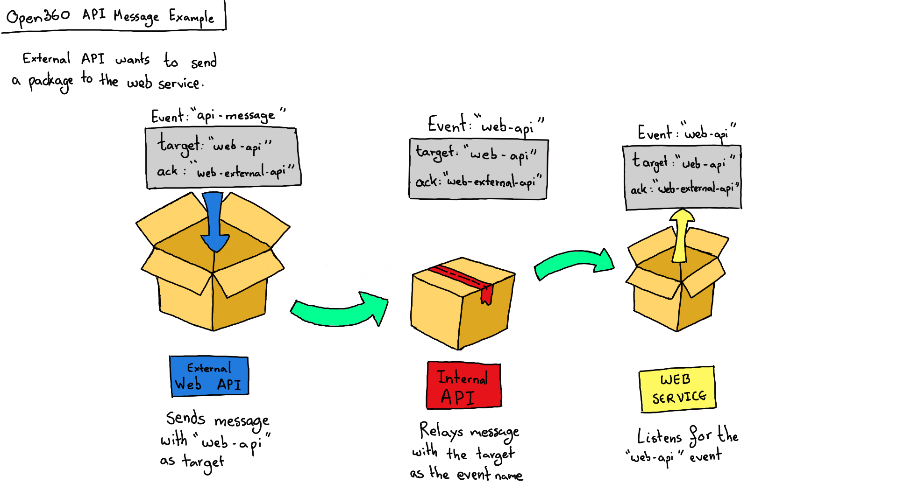
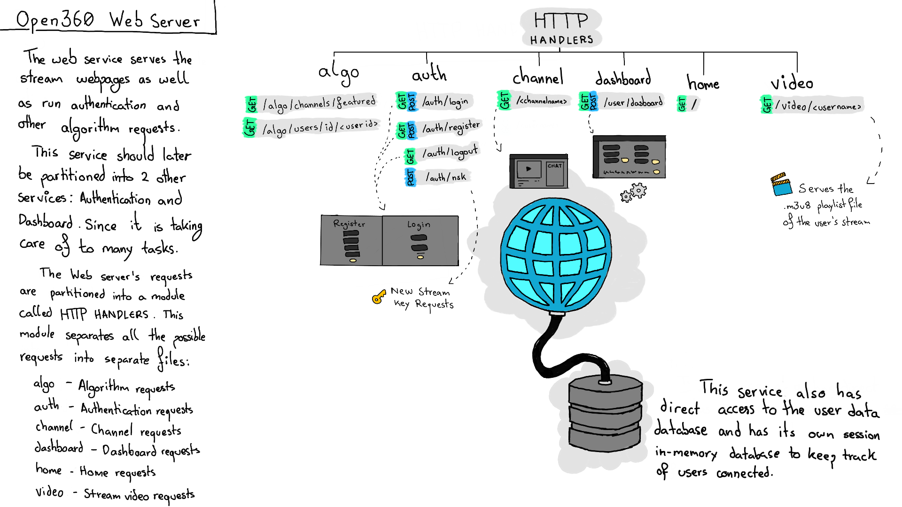
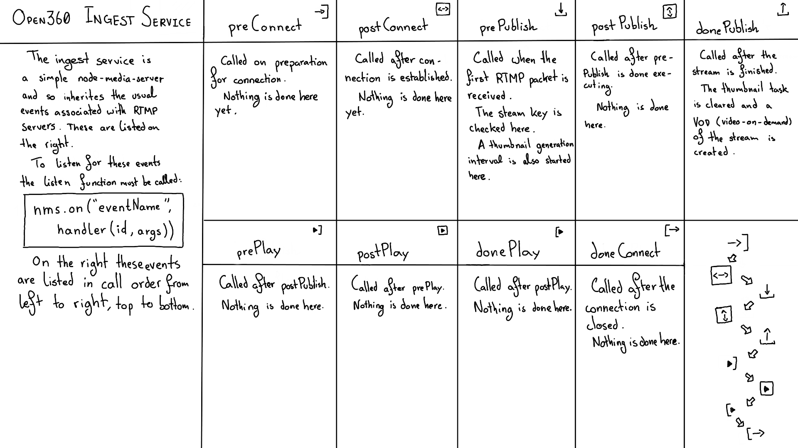
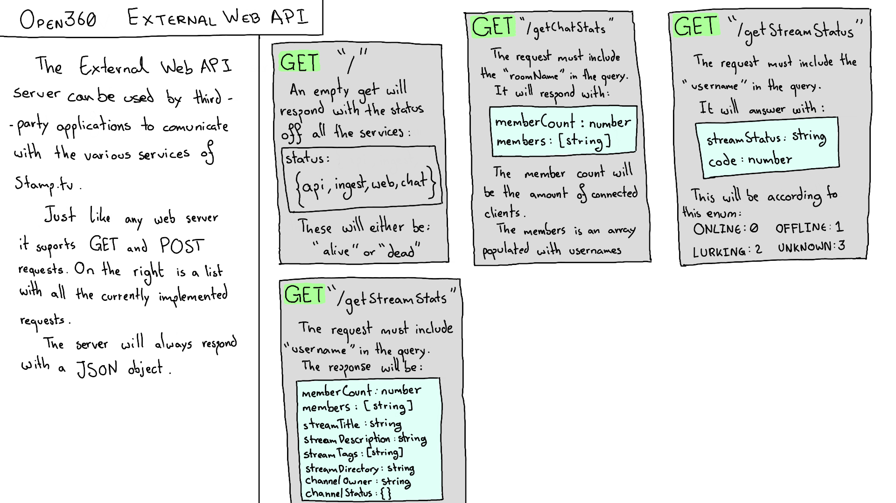
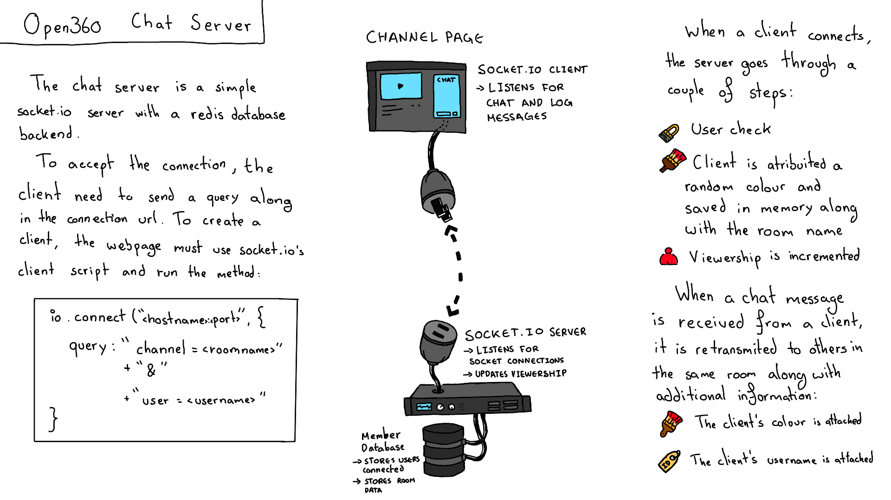

# Server Architecture



Open360 works on a microservice architecture, meaning the product is divided into various services talking to each other.

The services talk to each other by sending messages to the internal API service. This service also keeps a log of the messages sent around.

The services that are accessible from the outside are:

- External Web API  (HTTP)
- Web Server (HTTP)
- Chat Server  (Socket.io)
- Ingest Server (RTMP)

## Internal API Service



The function of the Internal API Service is to relay and log messages between microservices. Each service connects to the API server using a Socket.io-client in Node.js.

To send a message from one service to another, it must emit a `"api-message"` event on its socket. The data sent must be a JSON object with the following structure (also described in the image above):

````json
{
    target: string,
    ack: string,
    type: APIMessageType,
    package: {actual data for the target}
}
````

When the Internal API relays a message, it emits the message with the target given as the event name. Services can then listen to these events. The following picture shows an example message from the `"web-external-api"` to the `"web-api"`.



In this example the Web External API is sending a message to the Web Service. The message is first sent with the event `"api-message"` with the label `"web-api"` as its target. The Internal API listens to this event and relays it with the `"web-api"` as the new event. On the other end the Web Service listens for the `"web-api"` event and processes the `package` sent.

`ack` is then used by the Web Service to send a message back with the response message's `target` as the `ack` of the received message.

The `package` in the message has 2 different possible structures:

```javascript
// Normal Package
package = {
    // Used by the target service to know how to handle the data and possible answer it
    prompt: "string", 
    // Used by the target service to process and handle
    data: {whatever data needed},
    // A small string logged by the Internal API Server
    message: "string"
}
// Status Package
package = {
    // Asks for the status of a service, replying with either "alive" or "dead" in its data on the "status-reply" prompt
    prompt: "status"
}
```

The `prompt` describes what the data is about. It determines how the target service will handle the data.

For example, a package with the prompt set to `"checkKeyExists"` sent to the Web Service will make the Web Service use the `streamKey` in the package's data and compare it to the database. Then it will respond with a message with the prompt set to `"checkKeyExists-reply"` and `exists` in the package's data determining if the key truly exists.

_Message sent by the Ingest service to check if a stream key exists:_

```javascript
let message = {
    target: "web-api",
    ack: "ingest-api",
    type: "question",
    package: {
        prompt: "checkKeyExists",
        data: {
            streamKey: "<steamKey>"
        },
        message: "Checking Stream Key"
    }
}
```

_Message sent back to the Ingest service by the Web service with the result of the check:_

```javascript
let message = {
    target: "ingest-api",
    ack: "web-api",
    type: "message",
    package: {
        prompt : "checkKeyExist-reply",
        data: {
            exists: "<check-result>"
        },
        message: "Ok"
    }
}
```

---

For a service to know if it should send a message back to the `ack` service, the `type` of the message must be set to either: `"message"` or `"question"`.

A `"question"` is a message that expects a message back. Something like requesting the prompt `"streamStatus"` from the `"web-api"` requires a message back with the prompt `"streamStatus-reply"`.

A `"message"` is a one-way event. For example: the prompt `"setOnline"` on the Web Service sets a channel's status but doesn't require a message sent back.


# Web Service



The web service serves the stream webpages as well as run authentication and algorithm requests. This service should later be repartitioned into 2 other services: Authentication and Dashboard since it is taking care of too many tasks.

The Web server's requests are partitioned into a module called HTTP Handlers which separates all the possible requests into separate files:

- algo - Algorithm requests
- auth - Authentication and StreamKey generation requests
- channel - Channel pages requests
- dashboard - Dashboard page requests
- home - Home page and explore requests
- video - Stream Master Playlist and future VOD requests

This service has direct access to the database and it's own session in-memory database to keep track of users accessing the site (it does not track what pages they are accessing).

# Ingest Service



The ingest service is a simple fork of node-media-server and inherits the usual events associated with RTMP servers. These events are in this order:

1. `preConnect` 
   - Called on preparation for a connection.
2. `postConnect`
   - Called after a connection is established.
3. `prePublish`
   - Called when the first RTMP packet is recieved.
   - The stream key is checked here.
   - The thumbnail generation task is started here.
4. `posPublish`
   - Called after prePublish is done executing.
5. `donePublish`
   - Called after the RTMP stream is finished.
   - The thumbnail generation task is cleared here.
   - A VOD (video-on-demand) of the stream is created.
6. `prePlay`
   - Called after postPublish.
7. `postPlay`
   - Called after prePlay.
8. `donePlay`
   - Called after postPlay.
9. `doneConnect`
   - Called after the connection is closed.

To listen to these events, the ingest server calls this listener function:

```javascript
nms.on("<eventName>", function(id, args) {
    // Code here
    // let streamKey = getStreamKeyFromStreamPath(streamPath);
});
```

## Excerpt: prePublish

During this event, the ingest server has to check if the streamKey is real and the live stream can be accepted.

```javascript
// The stream key is retrieved
let streamKey = getStreamKeyFromStreamPath(streamPath);

// The session is retrieved
let session = nms.getSession(id);

// An API question is sent to the Web Service to check for the existance of this key
requestCheckStreamKeyExist(streamKey)
    // "exists" defines the existance of the key
    .then((exists) => {
        // Check if "exists" is false
        if (!exists){
            // Key is not real so reject session
            session.reject();
        } else {
            // Rest of the code...
        }
    })
```

# External Web API Service



The External Web API Service  can be used by third-party applications to communicate with the various services of Open360.

It supports HTTP GET and POST requests. The server will always respond with a JSON object.

The following list shows some of the current supported External API requests available.

## `GET "/"`

Making a empty request to the root url of the server will respond with the status of all the services.

```json
{
    status: {
        api: "string",
        ingest: "string",
        web: "string",
        chat: "string"
    }
}
```

These strings could either be "alive", "dead" or "zombie". "alive" and "dead" define if the service is online or offline. "zombie" means the service had an error and has entered a unavailable state.

## `GET "/getStreamStatus"`

This request must include `username` in the query. It will answer with:

```json
streamStatus: "string",
code: number
```

This will be according to the following table:

| streamStatus | code |
|:-:|:-:|
| "ONLINE" | 0 |
| "OFFLINE" | 1 |
| "LURKING" | 2 |
| "UNKNOWN" | 3 |

## `GET "/getStreamStats"`

The request must include `username` in the query. It will answer with:

```json
{
    memberCount: number,
    members: ["string"],
    streamTitle: "string",
    streamDescription: "string",
    streamTags: ["string"],
    streamDirectory: "string",
    channelOwner: "string",
    channelStatus: {
        streamStatus: "string",
        code: number
    }
}
```

# Chat Service



The chat server is a socket.io server with a redis in-memory database backend.

To accept a socket connection, the client needs to send a query allong with the connection url. To create a client, the webpage must use socket.io's client script and run the method:

```javascript
io.connect("<hostname>:<port>", function(){
    query: "channel=<roomname>"
        + "&"
        + "user=<username>"
});
```

When a client connects, the server goes through a couple of steps:

1. User check
2. Client is attribuited a random colour and saved in memory along with the room name
3. Viewership is incremented (and sent to the web server)

When a chat message is received from a client it is retransmited to others in the same room along with additional information saved in the in-memory database:

- The client's chat colour is attached
- The client's original displayname is attached